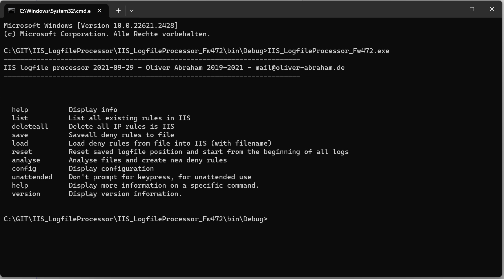

# IIS_LogfileProcessor

    

# OVERVIEW

Application to ban malicious attackers from IIS based on IIS logs.

The idea behind this app is to monitor IIS logfiles constantly and ban malicious attackers by creating a deny rule for the attackers IP address.
I wrote this app because I have a web application that doesn't need to serve the whole world.
I only want to serve a limited group of customers. 

Attackers can easily be found by inspecting the files and folders tey try to access. 
My IIS application serves as a honeypot, even if it is not intended to be one.
For example, IIS installations often get requests for directories like admin, cgi-bin or files like java.php, main.jsp.
My app will ban the IP address or address range of the attacker if he tries to access such a file or directory.	

# Usage

To keep it simple, I wrote a command line program with DotNET Framework 4.7.2, intended to be run as a scheduled task on the IIS machine.
It will read the IIS log directories, process them and create deny rules in the IIS for the attackers IP address.

# Configuration

You need to edit the file appsettings.json.
You can enter a whitelist and a blacklist of folders and files.
For banning, you can decide how large the banned address space will be.
You can ban only the attackers IP address or the whole address range of the attackers IP address.
For example, if you enter the network mask 255.255.255.0, the whole range of 256 IP addresses will be banned.

# Command line options

- help:          Display info
- list:          List all existing rules in IIS
- deleteall:     Delete all IP rules is IIS
- save:          Saveall deny rules to file
- load:          Load deny rules from file into IIS (with filename)
- reset:         Reset saved logfile position and start from the beginning of all logs
- analyse:       Analyse files and create new deny rules
- config:        Display configuration
- unattended:    Don't prompt for keypress, for unattended use
- help:          Display more information on a specific command.
- version:       Display version information.

## License

Licensed under Apache licence.
https://www.apache.org/licenses/LICENSE-2.0

## Compatibility

The nuget package was build with DotNET framework 4.7.2.

## AUTHOR

Oliver Abraham, mail@oliver-abraham.de, https://www.oliver-abraham.de

Please feel free to comment and suggest improvements!

## SOURCE CODE

The source code is hosted at:

https://github.com/OliverAbraham/IIS_LogfileProcessor

## SCREENSHOTS

# MAKE A DONATION !
If you find this application useful, buy me a coffee!
I would appreciate a small donation on https://www.buymeacoffee.com/oliverabraham

